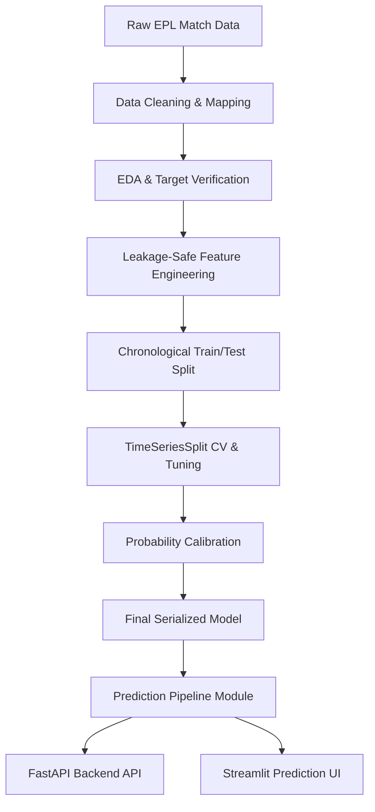

# ⚽ Premier League Match Outcome Prediction

A serious, end-to-end machine learning project that predicts the outcome of English Premier League matches:
* `H` = Home Win
* `D` = Draw
* `A` = Away Win

The project focuses on **leakage-safe historical feature engineering**, **chronological validation**, and **probability calibration** to ensure that model outputs represent actual frequencies.

---

## 🏗️ Architecture



See [architecture.md](file:///home/avrbt/Documents/Projects/Prem_League/docs/architecture.md) for details.

---

## 📊 Model Comparison & Results

All models were evaluated on the exact same chronological test set (comprising seasons 2020/21 to 2024/25).

| Model | Accuracy | Macro F1 | Log Loss |
| :--- | :---: | :---: | :---: |
| **Logistic Regression (Final Model)** | **0.5401** | **0.3977** | **0.9915** |
| **Random Forest (Baseline)** | 0.4985 | 0.3995 | 1.0229 |
| **XGBoost (Baseline)** | 0.4783 | 0.4088 | 1.0816 |
| **Tuned XGBoost** | 0.5235 | 0.3741 | 0.9961 |
| **Calibrated XGBoost** | 0.5174 | 0.3688 | 1.0000 |

### Model Selection Decision
While tree-based ensemble models (Random Forest and XGBoost) are more complex, **Logistic Regression** was chosen as the final production model. It achieves the best generalization on the out-of-sample chronological test set, delivering the lowest **Log Loss (0.9915)** and the highest **Accuracy (54.01%)**. This highlights that simple, well-regularized linear models often generalize better in sports outcome prediction tasks where the signal-to-noise ratio is low.

### Draw Prediction Insight
Due to severe class imbalance (Draws represent only ~24.6% of matches) and high outcome volatility, models tend to output low draw probabilities. The application displays these outputs as probabilities (e.g. 26% Draw, 54% Home, 20% Away) which is the most realistic way to communicate the high uncertainty of draw outcomes.

---

## ⚙️ How to Run

### 1. Set Up Environment
```bash
python3 -m venv venv
source venv/bin/activate
pip install -r requirements-dev.txt
```

### 2. Run Tests
```bash
PYTHONPATH=. ./venv/bin/pytest
```

### 3. Run FastAPI Backend
```bash
PYTHONPATH=. ./venv/bin/uvicorn app.main:app --reload
```
API Documentation will be available at `http://127.0.0.1:8000/docs`.

### 4. Run Streamlit UI
```bash
./venv/bin/streamlit run app/ui.py
```
Open your browser at the local address printed by Streamlit.

### 5. Deployment with Docker
For independent production deployment, Dockerfiles are configured:
- **FastAPI API**: `Dockerfile.api`
- **Streamlit UI**: `Dockerfile.streamlit`

See [deployment.md](file:///home/avrbt/Documents/Projects/Prem_League/docs/deployment.md) for full hosting platform guides.

---

## 📁 Repository Structure
See [PROJECT_STATUS.md](file:///home/avrbt/Documents/Projects/Prem_League/PROJECT_STATUS.md) for active tracking.
- `app/`: Streamlit interface (`ui.py`) and FastAPI backend (`main.py`).
- `src/`: Decoupled pipeline code (`config.py`, `data_loader.py`, `feature_engineering.py`, `prediction.py`).
- `models/`: Calibrated model, feature list, and metadata.
- `docs/`: In-depth project documentation (architecture, data dictionary, experiments log, model card).
- `tests/`: Automated test suite.
