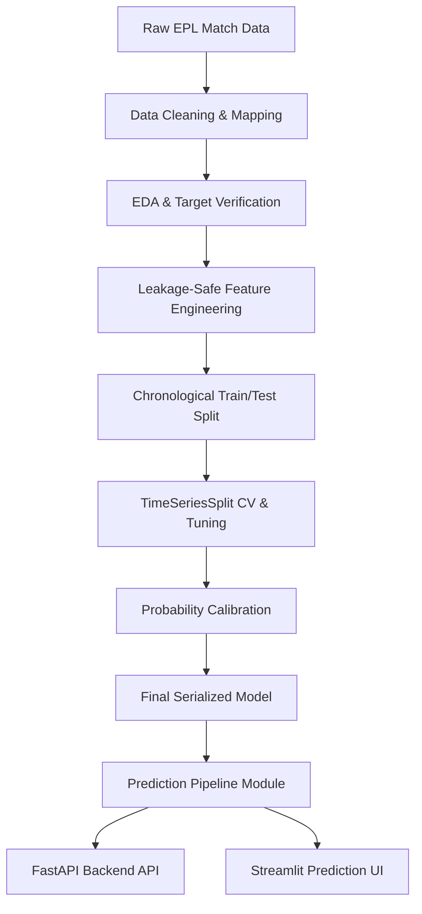

# System Architecture

The English Premier League match prediction system is designed around a decoupled, chronological, leakage-safe pipeline. Below is the block flow diagram representing the architecture:

## Description of Stages

1. **Raw Dataset**: Football matches data containing final goals, red/yellow cards, shots on target, etc.
2. **Data Cleaning**: Unified team names (resolving spellings across seasons), converting match dates, and cleaning invalid target results.
3. **Feature Engineering**: Calculates form, goals avg, win rates, goal difference, H2H, and rest days. Every rolling operation uses a `shift(1)` to ensure that only pre-match facts are used to predict the match (preventing data leakage).
4. **Chronological Validation**: Split older matches for training and newer seasons for testing. For cross-validation, `TimeSeriesSplit` is used to prevent time-travel leakage (never use future matches to validate past outcomes).
5. **Probability Calibration**: Uses Platt scaling (`CalibratedClassifierCV`) on top of XGBoost to ensure class probability outputs represent actual frequencies.
6. **Backend & UI**: Reusable python pipeline under `src/` fetches historical features on the fly, feeding them to the serialized model. The FastAPI backend exposes the predictions, which are consumed by the Streamlit frontend.
